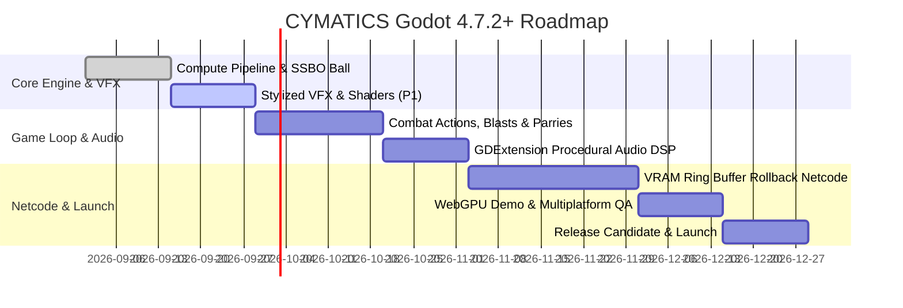

# CYMATICS — Game Design Document

> **Version:** 2.1  
> **Date:** 2026-08-29  
> **Engine:** Godot 4.7.2+ (with optional Rapier2D Deterministic Physics Server)  
> **Genre:** Physics-Sandbox Arcade Sport  
> **Platforms:** PC (primary), Web (WebGPU demo), Nintendo Switch, Mobile  
> **Players:** 1–4 (local / online)  
> **Session Length:** 2–5 minutes per match  
> **ESRB Target:** E for Everyone

---

## Table of Contents

1. [Identity & Vision](#1-identity--vision)
2. [Design Pillars](#2-design-pillars)
3. [Core Mechanics & Combat Feel](#3-core-mechanics--combat-feel)
4. [Kinetic VFX & Combat Juiciness](#4-kinetic-vfx--combat-juiciness)
5. [Gameplay Systems](#5-gameplay-systems)
6. [Game Modes](#6-game-modes)
7. [Visual Design & Aesthetics](#7-visual-design--aesthetics)
8. [Audio Design](#8-audio-design)
9. [Monetization & Distribution](#9-monetization--distribution)
10. [Development Milestones](#10-development-milestones)
11. [Sources & References](#11-sources--references)

---

## 1. Identity & Vision

### Elevator Pitch
*CYMATICS* is a hyper-kinetic 1v1 (and 2v2) arcade sport played inside a living, turbulent plasma field. Players manipulate paddles that stir, suck, and blast fluid currents to carve ball trajectories, trap opponents in vortex cavitation pockets, and score goals. It modernizes the *Plasma Pong* DNA with **deterministic physics, cutting-edge VFX shaders (refractive shockwaves, polar vortex accretion disks, frosted glass UI), and synesthetic procedural audio**.

### Why "CYMATICS"?
Cymatics is the study of visible acoustic and hydrodynamic phenomena in vibrating media. In CYMATICS, sound, fluid physics, and visual aesthetics form a unified feedback loop.

---

## 2. Design Pillars

| Pillar | Description |
|--------|-------------|
| **The Field Is Alive** | The plasma simulation is an active third player with momentum, eddies, viscoelastic surface tension, and pressure differentials. |
| **Tactile Hydrodynamics** | Every input feels like stirring an energized fluid. Reynolds numbers, drag, and fluid momentum directly govern the play space. |
| **Kinetic Impact & Juiciness** | Every hit, parry, and blast produces multi-layered visceral visual feedback (refractive shockwave lenses, polar vortex distortion, four-point star flares). |
| **Accessible Depth** | Simple two-button input enables immediate rallies; mastery requires reading pressure nodes, managing fluid inertia, and carving curve shots. |
| **Synesthetic Feedback** | Audio synthesis, visual chromatic aberration, and haptic rumble are computed directly from the underlying fluid physics in real time. |

---

## 3. Core Mechanics & Combat Feel

### 3.1 The Arena
- **Coordinate Space:** 16:9 aspect ratio, physics coordinates $1920 \times 1080$ (simulated on a $256 \times 144$ GPU grid, upscaled via bicubic sampling).
- **Boundaries:** Left and right edges represent goal lines. Top and bottom boundaries are rigid walls with momentum damping ($e = 0.95$).
- **Continuous Collision Detection (CCD):** Powered by deterministic continuous collision solvers preventing high-speed ($1800+\text{ px/s}$) ball tunneling.

### 3.2 Paddle Actions

| Action | Input | Hydrodynamic Effect | Combat & Visual Payoff |
|--------|-------|---------------------|------------------------|
| **Stir** | Stick / Mouse | Injects velocity wake and twin vortex pairs | Curves passing ball; leaves luminous hydrodynamic ribbon wakes. |
| **Suck** | Hold LT / LMB | Creates a radial sink and polar vortex accretion disk | Drags incoming ball; creates a swirling black-hole gravitational lens. |
| **Blast** | Charge RT / RMB | Directional shockwave and cavitation void | Launches ball at $1.5\times–3.0\times$ speed; emits expanding refractive shockwave ring. |
| **Parry** | Tap at impact ($\pm 4$ frames) | Counter-vortex shockwave and flow cancellation | Ball reflects with inverted spin at $120\%$ velocity; triggers four-point star flare and acoustic crack. |

```
                     PADDLE COMBAT ACTIONS & VISUAL FX
  
   [SUCK] (Accretion Lens)           [BLAST] (Refractive Shockwave)
        \   │   /                         ( ( ( ═══► (Refractive Lens)
      ───► [P1] ◄───                      [P1] ════►
        /   │   \                         ( ( ( ═══►
     (Polar UV Swirl)                  (Cavitation Flash)
  
   [STIR] (Ribbon Wake)              [PARRY] (Harmonic Star Burst)
      ▲     [P1]                          ✦ 4-Point Flare ✦
      │    / ↺ \                        [P1] ◄─── (Inverted Spin)
      │   (Vortex Trail)                 (Acoustic Crack)
```

---

## 4. Kinetic VFX & Combat Juiciness

Drawing inspiration from high-end stylized VFX pipelines, CYMATICS incorporates multi-layered visual effects that make every interaction feel explosive and responsive:

### 4.1 Polar Accretion Disk (Suck FX)
When a paddle activates **Suck**, the local UV space undergoes a logarithmic polar swirl distortion. Dye in the fluid is pulled into a high-density, luminous ring surrounding the paddle core, mimicking an astronomical black hole accretion disk.

### 4.2 Multi-Stage Refractive Shockwaves (Blast FX)
Releasing a **Blast** emits a multi-stage visual phenomenon:
1. **Frame 0–2 (Ignition):** High-intensity white core flare with instantaneous viewport chromatic kick.
2. **Frame 3–12 (Propagation):** An expanding `Line2D` refractive ring that dynamically samples and distorts background screen UVs.
3. **Frame 13–24 (Dissipation):** Shockwave front disintegrates into directional energetic streaks and dissipative turbulence.

### 4.3 Four-Point Harmonic Star Burst (Parry FX)
Timing a parry within the 4-frame window triggers:
* A high-contrast four-point anamorphic star flare at the contact point.
* Instantaneous cancellation of opponent dye in a 128-pixel radius.
* Screen-space hit-stop of 2 frames ($33\text{ ms}$) accompanied by an acoustic glass-shattering transient.

### 4.4 Cohesive Plasma Filaments (Ball Trail FX)
Rather than simple fading dye or linear particle trails, fast balls ($>800\text{ px/s}$) generate **viscoelastic plasma filaments**. Powered by surface tension constraints in the compute shader, these filaments stretch, coil, and snap like energized solar prominence loops.

---

## 5. Gameplay Systems

### 5.1 Rally Escalation

```
  0-3 Hits: CALM       ──► Laminar flow, baseline viscosity, serene ambient hum
  4-6 Hits: HEATING UP ──► Ball speed +10%, viscosity drops, drone cutoff rises
  7-10 Hits: OVERDRIVE ──► Ball ignites persistent filament trails, edge pulse
  11+ Hits: CYMATIC LOCK──► Screen zoom, sub-bass heartbeat, ball turns incandescent white
```

### 5.2 Momentum Meter & Resonance Super-Move
* **0–30%:** Baseline operations.
* **30–60%:** Suction intake radius and swirl velocity $+25\%$.
* **60–90%:** Blast charge rate $+50\%$.
* **100% (Resonance Arc):** Freezes local time for $0.4\text{s}$, displays a glowing trajectory curve through the plasma, and catapults the ball with extreme gyroscopic spin.

---

## 6. Game Modes

1. **Duel (1v1 Ranked / Casual):** Standard competitive rules. First to 7 points per set, best 2 of 3 sets.
2. **Doubles (2v2 Arena):** Expanded court ($2304 \times 1296$); synchronized teammate Blasts combine into a **Constructive Interference Mega-Wave**.
3. **Gauntlet (1vAI Campaign):** Tiered boss battles against procedural AI archetypes.
4. **Sandbox:** Full fluid laboratory with obstacle emitters, gravitational black holes, and custom parameter editing.
5. **Zen Mode:** Infinite rally sandbox with automated ball returns and ambient audio generation.

---

## 7. Visual Design & Aesthetics

### 7.1 Scientific Color Palette

| Role | Color Name | Hex Code | Purpose |
|------|------------|----------|---------|
| **Base Field** | Void Indigo | `#0a0514` | High-contrast absorption background |
| **Plasma Core** | Cosmic Violet | `#1a0b2e` | Ambient fluid field |
| **Player 1** | Electric Cyan | `#00e5ff` | High-luminance P1 dye & UI accents |
| **Player 2** | Hot Magenta | `#ff00aa` | Mid-luminance P2 dye & UI accents |
| **Ball** | Incandescent Solar | `#ffffff` / `#ffcc00` | Energy core & filament ribbons |
| **Shockwave** | Cavitation White | `#ffffff` | High-energy blast fronts |

### 7.2 Frosted Glass UI Interface
HUD panels use physical **frosted glass shaders** featuring multi-sample blur dispersion, screen refraction, and dynamic edge specularity, allowing the swirling plasma underneath to remain subtly visible without sacrificing text legibility.

---

## 8. Audio Design

* **Fluid Drone:** Bandpass-filtered brown noise driven by fluid field kinetic energy ($\frac{1}{2}\sum \|v\|^2$).
* **Ball FM Synthesis:** Pitch mapped to velocity ($110\text{ Hz} \to 880\text{ Hz}$); modulation index mapped to fluid curl ($\nabla \times v$).
* **Paddle Granular Droplets:** Microscopic granular synthesis emitting droplet textures proportional to paddle velocity.
* **Score Chords:** Additive harmonic triads derived from the exact RGB dye concentration at the goal plane.

---

## 9. Monetization & Distribution

* **Web Demo (WebGPU):** Free 1v1 local duel.
* **PC (Steam) & Consoles:** Premium ($14.99–$19.99) full release with Rollback Netcode, 2v2, Gauntlet, and Sandbox.
* **Cosmetics:** Custom dye palettes, geometric paddle chassis, procedural chord scales. No pay-to-win mechanics.

---

## 10. Development Milestones



---

## 11. Sources & References

1. **Stam, Jos.** *Real-Time Fluid Dynamics for Games.* GDC 2003.
2. **appsinacup.** *Godot Rapier Physics — 2D/3D Deterministic Physics Engine & Liquid Simulation.* GitHub, 2024.
3. **Pavel Dobryakov.** *WebGL Fluid Simulation.* (GPU Navier-Stokes pipeline).
4. **Cannon, Tony (GGPO).** *Rollback Networking Architecture for Deterministic Physics.* 2006.
5. **Pelonis, George.** *Plasma Pong.* 2004. (Original concept homage).

---

*Document maintained by the CYMATICS core engineering team. For technical architecture details, see `CYMATICS_Technical_Spec.md`.*
